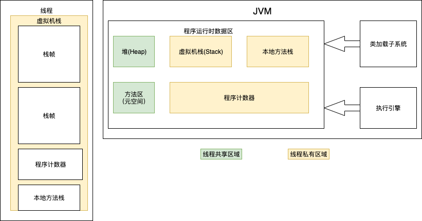
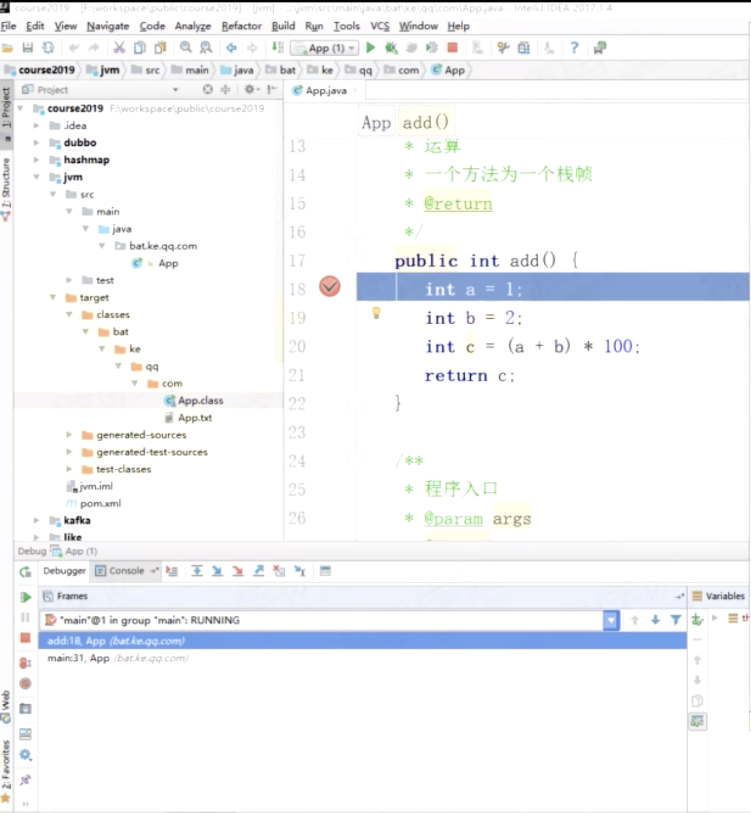
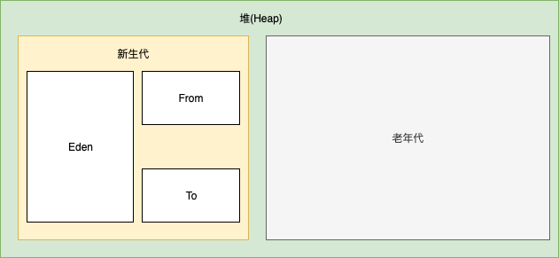
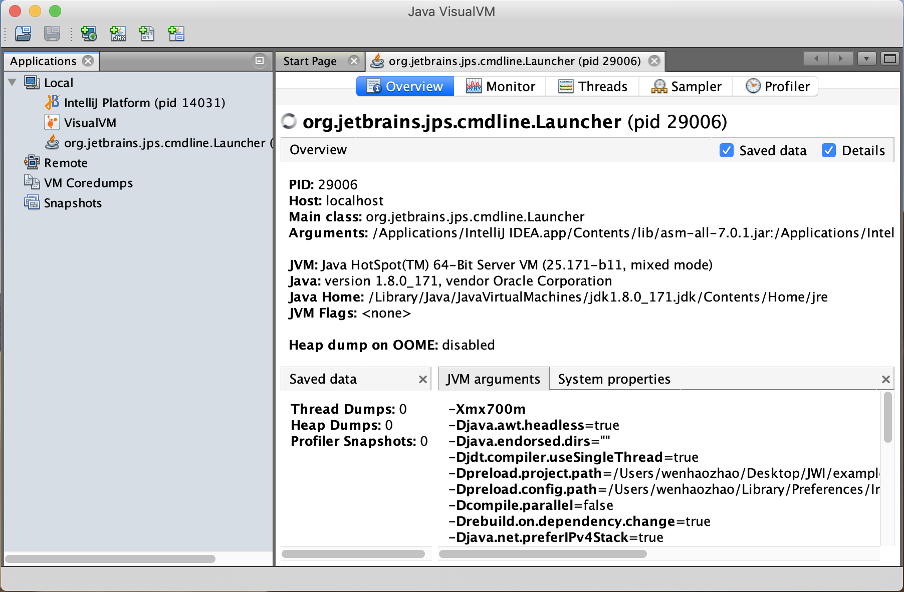
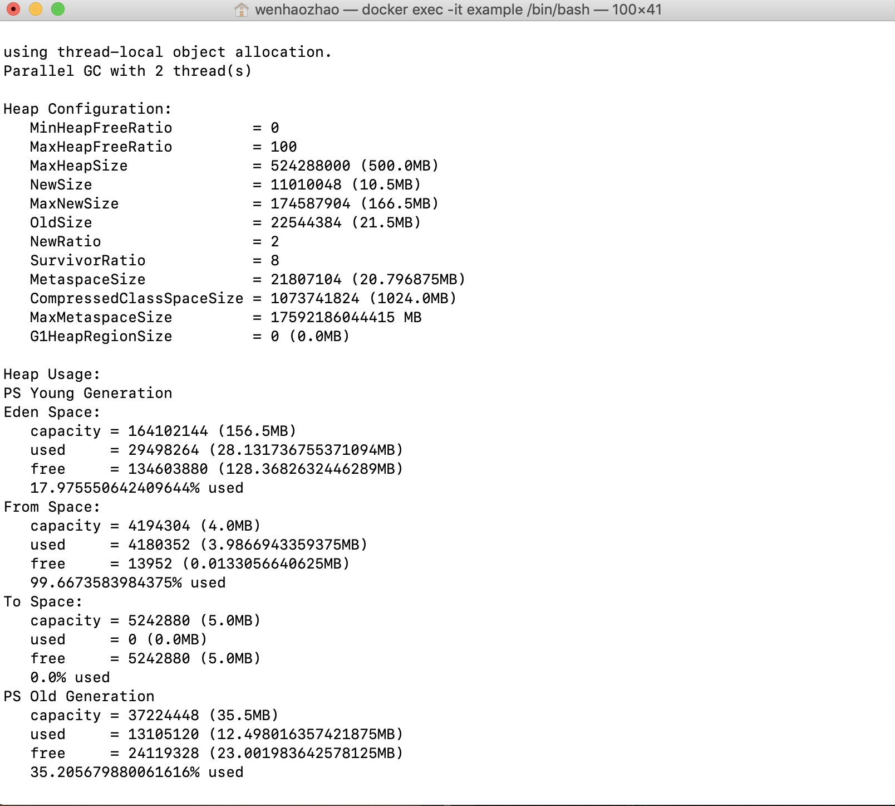

# JVM 运行原理


1. 一个方法为一个栈帧(Stack frame)
2. 虚拟机栈 =》先进后出

### 栈帧


### 堆

* 对象在Eden创建
* Eden区对象占满时触发GC（垃圾回收）=》 minor GC(将可回收对象(即长时间没有被调用的对象)进行回收) =》 将不可回收对象放入From区并且对象头计数+1
* 当From区满时，对象将会被拷贝到TO区,对象头数+1。From区和TO区将会互换
* 当对象的age为15(JVM默认年龄大小)时将进入老年代
* 当老年代被占满时将触发full GC/major GC =》STW 停顿 => 减少吞吐量

### Java 内存监控工具(Java Visual VM)
* jvisualvm
* visual GC



### Docker Container中JVM内存监控
启动container是需指定“--cap-add=SYS_PTRACE”使得在container内能够操作PTRACE
```
docker run -d -p 8080:8080 --cap-add=SYS_PTRACE --name=example example-service 
```
进入container
```
docker exec -it example /bin/bash
```
查看jps进程
```
jps
```
jmap输出监控信息
```
jmap -heap [pid]
```
p.s.


查看JVM堆中对象详细占用情况
```
jmap -histo [pid]
```


### JVM 内存分配
新生代 ( Young ) 与老年代 ( Old ) 的比例的值为 1:2 ( 该值可以通过参数 –XX:NewRatio 来指定 )

默认的，Eden : from : to = 8 : 1 : 1 ( 可以通过参数 –XX:SurvivorRatio 来设定 )，即： Eden = 8/10 的新生代空间大小，from = to = 1/10 的新生代空间大小。

方法区(Method Area)：
在JVM启动之前通过在命令行设置参数-XX:MaxPermSize来设定永久代最大可分配的内存空间，默认大小是64M（64位JVM默认是85M）。

方法区配置：
```
-XX:PermSize=64MB 最小尺寸，初始分配
-XX:MaxPermSize=256MB 最大允许分配尺寸，按需分配
XX:+CMSClassUnloadingEnabled -XX:+CMSPermGenSweepingEnabled 设置垃圾不回收
默认大小
-server选项下默认MaxPermSize为64m
-client选项下默认MaxPermSize为32m
```

内存参数设置：
```
-Xms设置堆的最小空间大小。
-Xmx设置堆的最大空间大小。
-Xmn:设置年轻代大小
-XX:NewSize设置新生代最小空间大小。
-XX:MaxNewSize设置新生代最大空间大小。
-XX:PermSize设置永久代最小空间大小。
-XX:MaxPermSize设置永久代最大空间大小。
-Xss设置每个线程的堆栈大小
-XX:+UseParallelGC:选择垃圾收集器为并行收集器。此配置仅对年轻代有效。即上述配置下,年轻代使用并发收集,而年老代仍旧使用串行收集。
-XX:ParallelGCThreads=20:配置并行收集器的线程数,即:同时多少个线程一起进行垃圾回收。此值最好配置与处理器数目相等。
```

JVM参数配置参考
```
java-Xmx3550m-Xms3550m-Xmn2g-Xss128k
-XX:ParallelGCThreads=20
-XX:+UseConcMarkSweepGC-XX:+UseParNewGC
-Xmx3550m:设置JVM最大可用内存为3550M。

-Xms3550m:设置JVM促使内存为3550m。此值可以设置与-Xmx相同,以避免每次垃圾回收完成后JVM重新分配内存。

-Xmn2g:设置年轻代大小为2G。整个堆大小=年轻代大小+年老代大小+持久代大小。持久代一般固定大小为64m,所以增大年轻代后,将会减小年老代大小。此值对系统性能影响较大,官方推荐配置为整个堆的3/8。

-Xss128k:设置每个线程的堆栈大小。JDK5.0以后每个线程堆栈大小为1M,以前每个线程堆栈大小为256K。更具应用的线程所需内存大小进行调整。在相同物理内存下,减小这个值能生成更多的线程。但是操作系统对一个进程内的线程数还是有限制的,不能无限生成,经验值在3000~5000 左右。
```
