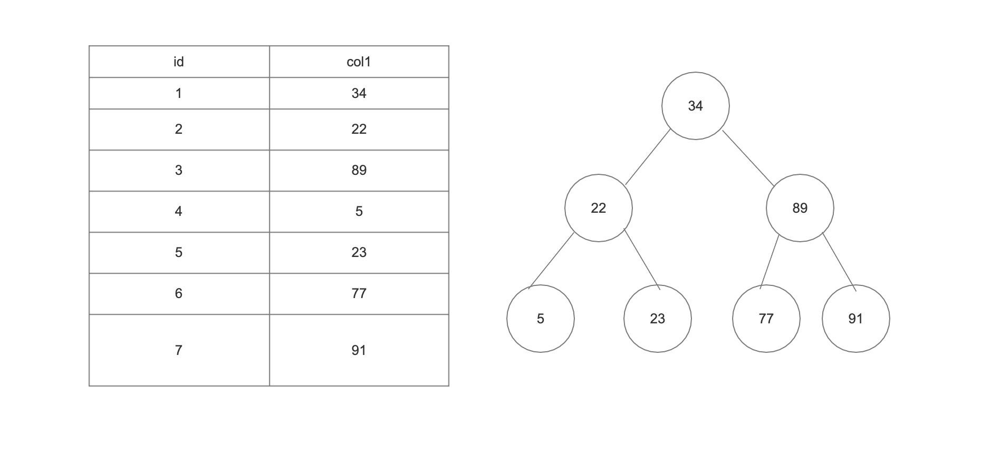
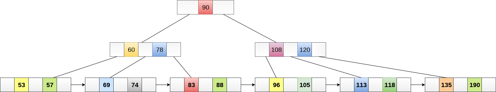
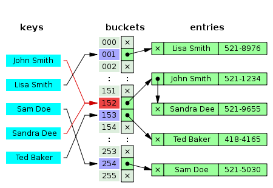

# 存储引擎与索引

## 二叉树索引(Binary Search Tree)
特点：左小右大

## B 树 (B-Trees)
*   度(Degree)-每个节点的存储个数
*   每个节点最多有m-1个关键字
*   根节点最少可以只有1个关键字。
*   非根节点至少有m/2个关键字。
*   叶节点具有相同的度
*   每个节点中的key从左到右递增排列
*   所有叶子节点都位于同一层。
*   叶节点指针为空
*   每个节点都存有对应的key和value。

## B+ 树 (B+ Tree)
*   非叶子节点不存储data,只存储key，可有效的增加度
*   叶子节点存储指针
*   顺序访问指针，提高区间访问性能

## Hash 索引
Best Case: O(1)
