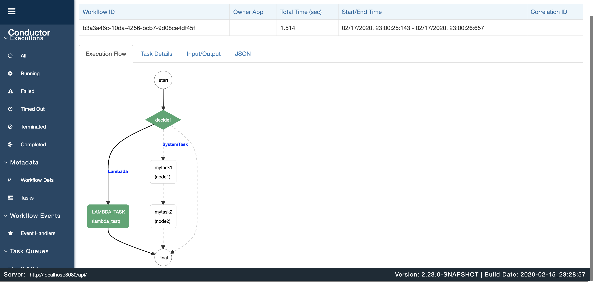
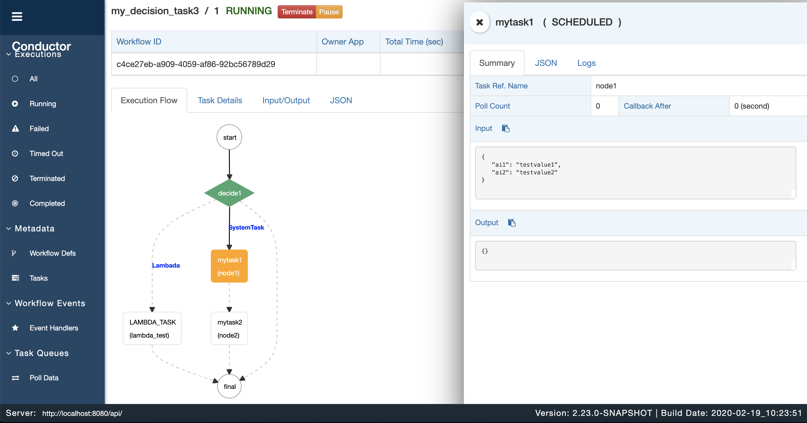

# Netflix Conductor Decision Task

## Task 定义
URL POST
```
http://localhost:8080/api/metadata/taskdefs
```

BODY
```
[
    {
        "name":"decide_task",
        "inputKeys":[
            "decision"
        ]
    },
    {
        "name":"LAMBDA_TASK"
    },
    {
        "name":"mytask1"
    },
    {
        "name":"mytask2"
    }
]
```

## Workflow 定义
URL POST
```
http://localhost:8080/api/metadata/workflow
```
BODY
```
{
    "name": "my_decision_task",
    "tasks": [
        {
            "name": "decide_task",
            "taskReferenceName": "decide1",
            "inputParameters": {
                "case_value_param": "${workflow.input.decision}"
            },
            "type": "DECISION",
            "caseValueParam": "case_value_param",
            "decisionCases": {
                "Lambada": [
                    {
                        "name": "LAMBDA_TASK",
                        "taskReferenceName": "lambda_test",
                        "type": "LAMBDA",
                        "inputParameters": {
                            "lambdaValue": "1",
                            "scriptExpression": "if ($.lambdaValue == 1){ return {testvalue: true} } else { return {testvalue: false} }"
                        }
                    }
                ],
                "SystemTask": [
                    {
                        "name": "mytask1",
                        "taskReferenceName": "node1",
                        "type": "SIMPLE",
                        "inputParameters": {
                            "ai1": "testvalue1",
                            "ai2": "testvalue2"
                        }
                    },
                    {
                        "name": "mytask2",
                        "taskReferenceName": "node2",
                        "type": "SIMPLE",
                        "inputParameters": {
                            "bi1": "1",
                            "bi2": "2"
                        }
                    }
                    
                ]
            }
        }
    ]
}
```

## 执行流程
Lambada Decision

System Task Decision
