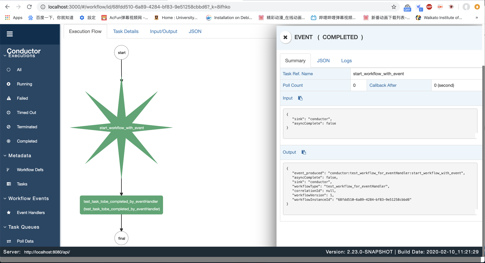
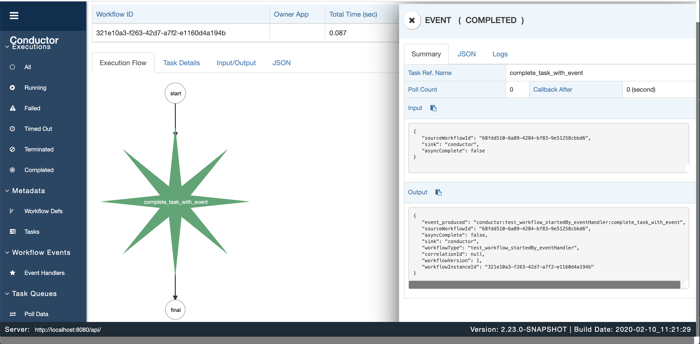

# Netflix Conductor Event and Event Handler

# Workflow 定义
URL POST
```
http://localhost:8080/api/metadata/workflow
```
## 第一个Event task
```
{
  "name": "test_workflow_for_eventHandler",
  "description": "A test workflow to start another workflow with EventHandler",
  "version": 1,
  "tasks": [
    {
      "name": "test_start_workflow_event",
      "taskReferenceName": "start_workflow_with_event",
      "type": "EVENT",
      "sink": "conductor"
    },
    //等待event执行完毕后执行
    {
      "name": "test_task_tobe_completed_by_eventHandler",
      "taskReferenceName": "test_task_tobe_completed_by_eventHandler",
      "type": "WAIT"
    }
  ]
}
```
## 第二个 Event Task
```
{
  "name": "test_workflow_startedBy_eventHandler",
  "description": "A test workflow which is started by EventHandler, and then goes on to complete task in another workflow.",
  "version": 1,
  "tasks": [
    {
      "name": "test_complete_task_event",
      "taskReferenceName": "complete_task_with_event",
      "inputParameters": {
        "sourceWorkflowId": "${workflow.input.sourceWorkflowId}"
      },
      "type": "EVENT",
      "sink": "conductor"
    }
  ]
}
```

# Task 定义
URL POST
```
http://localhost:8080/api/event
```
## 第一个Event Task
第一个task定义了event事件调用另一个event
```
{
  "name": "test_start_workflow",
  "event": "conductor:test_workflow_for_eventHandler:start_workflow_with_event",
  "actions": [
    {
      "action": "start_workflow",
      "start_workflow": {
        "name": "test_workflow_startedBy_eventHandler",
        "input": {
          "sourceWorkflowId": "${workflowInstanceId}"
        }
      }
    }
  ],
  "active": true
}
```
## 第二个task定义
```
{
  "name": "test_complete_task_event",
  "event": "conductor:test_workflow_startedBy_eventHandler:complete_task_with_event",
  "actions": [
    {
        "action": "complete_task",
        "complete_task": {
            "workflowId": "${sourceWorkflowId}",
            "taskRefName": "test_task_tobe_completed_by_eventHandler"
         }
    }
  ],
  "active": true
}
```

# 执行workflow
URL POST
```
http://localhost:8080/api/workflow/test_workflow_for_eventHandler
```
```
{
	"sourceWorkflowId":"testId"
}
```

# 执行流程
Task 1

Task 2 -- 将 第一个event task的workflowInstanceId作为第二个event task 的 sourceWorkflowId 输入值

