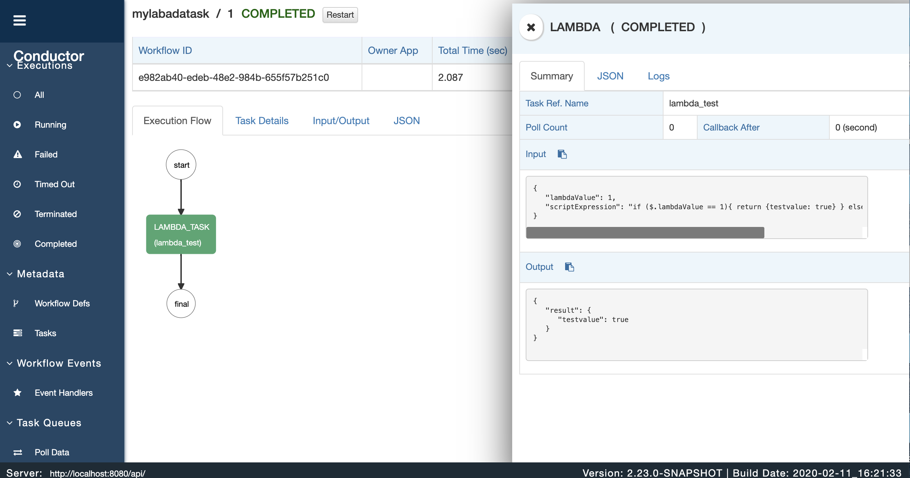

# Netflix Conductor Lambada Task
通过lambada表达式控制workflow输入值

## Workflow 定义
URL
```
POST http://localhost:8080/api/metadata/workflow
```
BODY
```
{
    "name":"mylabadatask",
    "version":1,
    "tasks": [
        {
            "name": "LAMBDA_TASK",
            "taskReferenceName": "lambda_test",
            "type": "LAMBDA",
            "inputParameters": {
                "lambdaValue": "${workflow.input.lambdaValue}",
                "scriptExpression": "if ($.lambdaValue == 1){ return {testvalue: true} } else { return {testvalue: false} }"
            }
        }
    ],
    "outputParameters": {
        "testvalue": "${lambda_test.output.result.testvalue}"
    }
}
```

### Task 定义
URL
```
POST http://localhost:8080/api/metadata/taskdefs
```
BODY
```
{
    "name":"LAMBDA_TASK",
    "inputKeys":[
        "lambdaValue"
    ],
    "outputKeys":[
        "testvalue"
    ]
}
```

## 执行Workflow
URL
```
POST http://localhost:8080/api/workflow/mylabadatask
```
BODY
```
{
	"lambdaValue":1
}
```

## 执行流程
