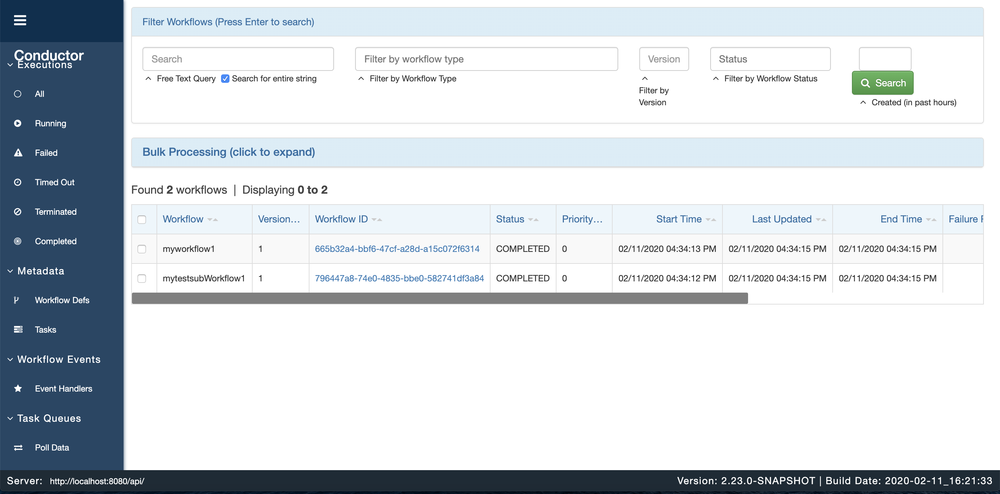
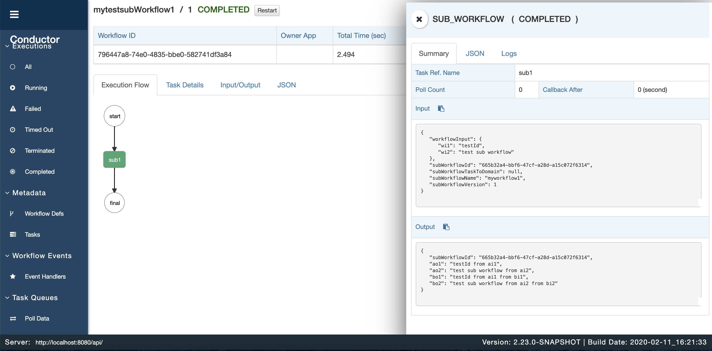
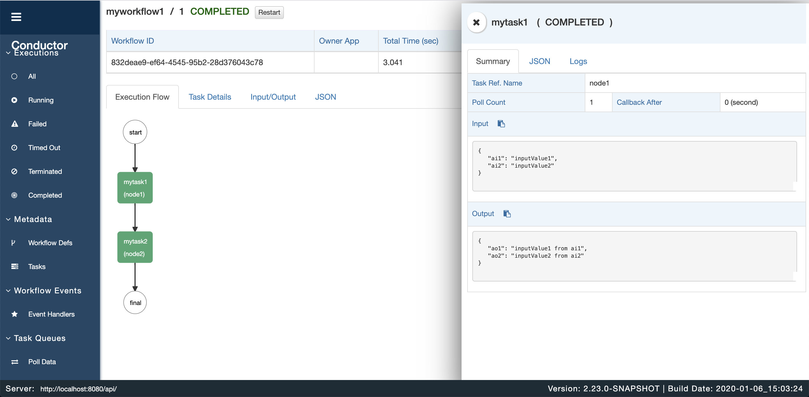

# Netflix Conductor Sub-workflow

## Workflow 定义
此workflow将传入的input parameter 作为 subworkflow 的输入。
```
{
    "name": "mytestsubWorkflow1",
    "description": "test sub-workflow",
    "tasks": [
        {
            "name": "sub_workflow_task",
            "taskReferenceName": "sub1",
            "inputParameters": {
                "wi1": "${workflow.input.requestId}",
                "wi2": "${workflow.input.name}"
            },
            "type": "SUB_WORKFLOW",
            "subWorkflowParam": {
                "name": "myworkflow1",
                "version": 1
            }
        }
    ]
}
```

## Task 定义
```
[
    {
        "name":"sub_workflow_task",
        "inputKeys":[
                "requestId",
                "name"
            ]
    }
]

```

## 执行Workflow
```
{
  "requestId":"testId",
  "name":"test sub workflow"
}
```

## 执行流程
运行时，执行workflow时将会同时执行subWorkflow。


