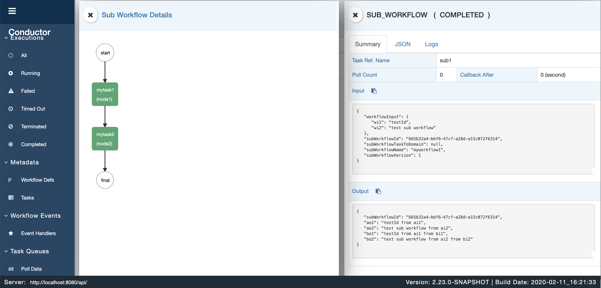

# Netflix Conductor System Task

## Conductor Client
main class
```
@SpringBootApplication
public class ConductorApplication {

    public static void main(String[] args) {
        //SpringApplication.run(ConductorApplication.class, args);
        TaskClient taskClient = new TaskClient();
        taskClient.setRootURI("http://localhost:8080/api/");

        int threadCount = 2;

        Worker worker1 = new MyWorker("mytask1");
        Worker worker2 = new MySecondWorker("mytask2");

        WorkflowTaskCoordinator.Builder builder = new WorkflowTaskCoordinator.Builder();
        WorkflowTaskCoordinator coordinator = builder.withWorkers(worker1,worker2).
                withThreadCount(threadCount).withTaskClient(taskClient).build();

        coordinator.init();

    }
}
```
第一个Worker
```
public class MyWorker implements Worker {
    private String taskDefName;

    public MyWorker(String taskDefName){
        this.taskDefName=taskDefName;
    }

    @Override
    public String getTaskDefName() {
        return taskDefName;
    }

    @Override
    public TaskResult execute(Task task) {
        System.out.printf("Executing %s\n", taskDefName);
        System.out.println("ai1:" + task.getInputData().get("ai1"));
        System.out.println("ai2:" + task.getInputData().get("ai2"));
        TaskResult result = new TaskResult(task);
        result.setStatus(TaskResult.Status.COMPLETED);

        //Register the output of the task
        result.getOutputData().put("ao1", String.valueOf(task.getInputData().get("ai1")) + " from ai1");
        result.getOutputData().put("ao2", String.valueOf(task.getInputData().get("ai2")) + " from ai2");
        return result;
    }
}
```
第二个Worker
```
public class MySecondWorker implements Worker{
    private String taskDefName;

    public MySecondWorker(String taskDefName){
        this.taskDefName=taskDefName;
    }

    @Override
    public String getTaskDefName() {
        return taskDefName;
    }

    @Override
    public TaskResult execute(Task task) {
        System.out.printf("Executing %s\n", taskDefName);
        System.out.println("bi1:" + task.getInputData().get("bi1"));
        System.out.println("bi2:" + task.getInputData().get("bi2"));
        TaskResult result = new TaskResult(task);
        result.setStatus(TaskResult.Status.COMPLETED);

        //Register the output of the task
        result.getOutputData().put("bo1", String.valueOf(task.getInputData().get("bi1")) + " from bi1");
        result.getOutputData().put("bo2", String.valueOf(task.getInputData().get("bi2")) + " from bi2");

        return result;
```

## API
### Task 定义
URL
```
POST http://localhost:8080/api/metadata/taskdefs
```
Body
```
[
    {
        "name": "mytask1",
        "retryCount": 3,
        "timeoutSeconds": 1200,
        "inputKeys": [
            "ai1",
            "ai2"
        ],
        "outputKeys": [
            "ao1",
            "ao2"
        ],
        "timeoutPolicy": "TIME_OUT_WF",
        "retryLogic": "FIXED",
        "retryDelaySeconds": 600,
        "responseTimeoutSeconds": 800
    },
    {
        "name": "mytask2",
        "retryCount": 3,
        "timeoutSeconds": 1200,
        "inputKeys": [
            "bi1",
            "bi2"
        ],
        "outputKeys": [
            "bo1",
            "bo2"
        ],
        "timeoutPolicy": "TIME_OUT_WF",
        "retryLogic": "FIXED",
        "retryDelaySeconds": 600,
        "responseTimeoutSeconds": 800
    }
]
```

### Workflow 定义
URL
```
POST http://localhost:8080/api/metadata/workflow
```
Body
```
{
    "ownerApp": "string",
    "createTime": 0,
    "updateTime": 0,
    "createdBy": "string",
    "updatedBy": "string",
    "name": "myworkflow1",
    "description": "my workflow for test",
    "version": 1,
    "tasks": [
        {
            "name": "mytask1",
            "taskReferenceName": "node1",
            "type": "SIMPLE",
            "inputParameters": {
                "ai1": "${workflow.input.wi1}",
                "ai2": "${workflow.input.wi2}"
            }
        },
        {
            "name": "mytask2",
            "taskReferenceName": "node2",
            "type": "SIMPLE",
            "inputParameters": {
                "bi1": "${node1.output.ao1}",
                "bi2": "${node1.output.ao2}"
            }
        }
    ],
    "outputParameters": {
        "ao1": "${node1.output.ao1}",
        "ao2": "${node1.output.ao2}",
        "bo1": "${node2.output.bo1}",
        "bo2": "${node2.output.bo2}"
    },
    "schemaVersion": 2
}
```

### 执行Workflow
URL
```
POST http://localhost:8080/api/workflow/myworkflow1
```
Body
```
{
	"wi1":"inputValue1",
	"wi2":"inputValue2"
}
```

## 执行流程
Task1:

Task2:
